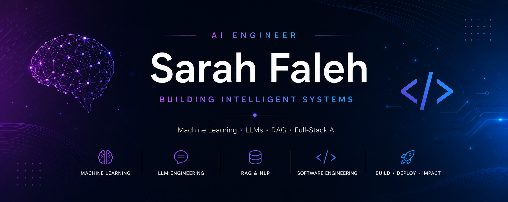
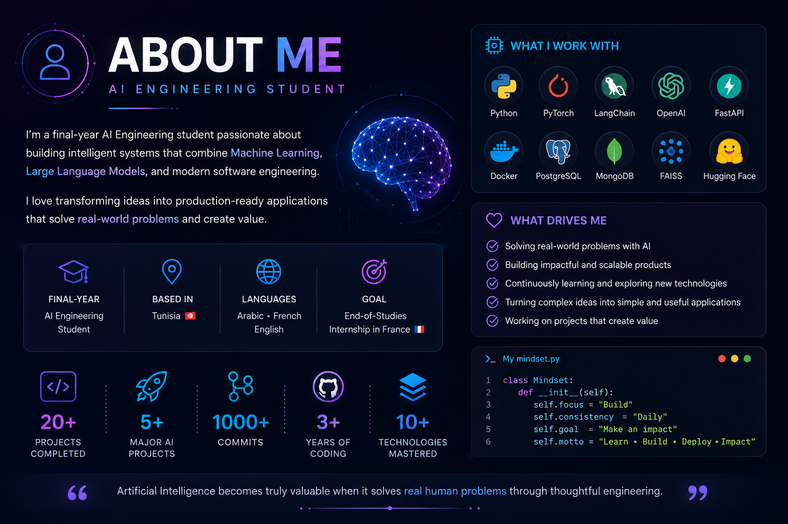
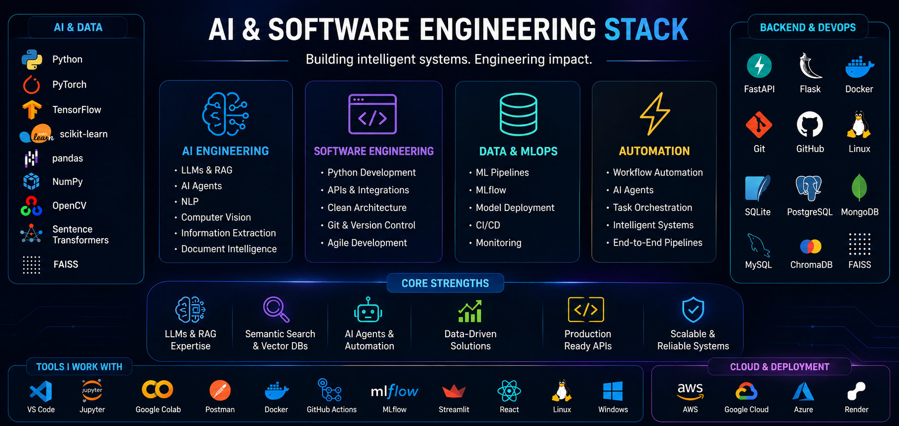
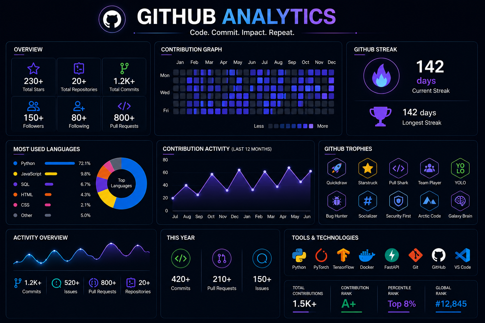
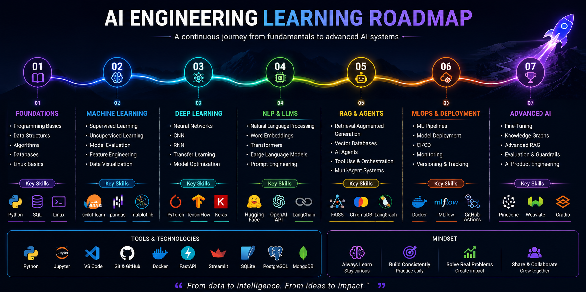

<div align="center">



<br>

# Sarah Faleh

### AI Software Engineer • Machine Learning • LLM Engineering • Retrieval-Augmented Generation


<br>

<a href="https://github.com/sarah-falehh">

</a>

<a href="https://www.linkedin.com/in/sarah-faleh/">

</a>

<a href="mailto:sarah.faleh.ai@gmail.com">

</a>


</div>

---

# About Me

<p align="center">



</p>

---

```python
class SarahFaleh:

    def __init__(self):

        self.role = "AI Software Engineer"

        self.education = "Final-Year AI Engineering Student"

        self.location = "Tunisia 🇹🇳"

        self.languages = [
            "Arabic",
            "French",
            "English"
        ]

        self.interests = [
            "Artificial Intelligence",
            "Machine Learning",
            "Large Language Models",
            "Retrieval-Augmented Generation",
            "Natural Language Processing",
            "Computer Vision",
            "MLOps",
            "Software Engineering"
        ]

        self.current_focus = [
            "Enterprise AI",
            "AI Agents",
            "LangGraph",
            "Advanced RAG",
            "Generative AI"
        ]

    def mission(self):

        return "Design intelligent AI products that solve real-world problems."

me = SarahFaleh()
```

---

## Who Am I?

I'm a final-year Artificial Intelligence Engineering student passionate about transforming research ideas into production-ready AI applications.

I enjoy building complete intelligent systems combining Machine Learning, Deep Learning, Large Language Models, Retrieval-Augmented Generation, MLOps and modern Software Engineering.

Rather than developing isolated models, I focus on designing scalable AI platforms integrating backend development, intelligent retrieval, user interfaces and production deployment.

---

## Areas of Expertise

- Artificial Intelligence
- Machine Learning
- Deep Learning
- Large Language Models (LLMs)
- Retrieval-Augmented Generation (RAG)
- Natural Language Processing
- Computer Vision
- MLOps
- REST APIs
- Full-Stack AI Applications

---

## Currently Exploring

- Multi-Agent Systems
- LangGraph
- Advanced RAG Pipelines
- Fine-Tuning LLMs
- Knowledge Graphs
- AI Product Engineering

---

## Looking For

🎯 End-of-Studies Internship (France)

Interested in positions related to:

- AI Engineering
- Machine Learning
- Data Science
- LLM Engineering
- NLP
- Computer Vision

---

> **"Great AI isn't only about building models—it's about engineering intelligent systems that create real impact."**

---
# AI & Software Engineering Stack

<p align="center">



</p>

---

## Artificial Intelligence

<p align="center">


</p>

<table>
<tr>

<td width="50%">

### Machine Learning

- Supervised Learning
- Unsupervised Learning
- Feature Engineering
- Model Evaluation
- Ensemble Methods
- Regression
- Classification
- Clustering
- Cross Validation
- Hyperparameter Optimization

</td>

<td width="50%">

### Deep Learning

- Neural Networks
- CNN
- Transfer Learning
- Computer Vision
- Image Classification
- Image Segmentation
- Object Detection
- Representation Learning

</td>

</tr>
</table>

---

## Large Language Models

<div align="center">

| Technology | Experience |
|------------|------------|
| GPT Models | ⭐⭐⭐⭐⭐ |
| Retrieval-Augmented Generation | ⭐⭐⭐⭐⭐ |
| Prompt Engineering | ⭐⭐⭐⭐⭐ |
| Semantic Search | ⭐⭐⭐⭐⭐ |
| Vector Search | ⭐⭐⭐⭐☆ |
| Embeddings | ⭐⭐⭐⭐☆ |
| Document Intelligence | ⭐⭐⭐⭐⭐ |
| Information Extraction | ⭐⭐⭐⭐⭐ |

</div>

---

## Natural Language Processing

```text
Named Entity Recognition
Sentence Classification
Topic Extraction
Language Detection
Keyword Extraction
Document Chunking
Semantic Retrieval
Text Classification
Multilingual Processing
Information Extraction
```

---

## AI Frameworks

<p align="center">


</p>

---

## LLM Engineering

✔ Prompt Engineering

✔ Retrieval-Augmented Generation

✔ Semantic Search

✔ Embedding Models

✔ FAISS Vector Search

✔ Knowledge Base Construction

✔ Contextual Retrieval

✔ Document Intelligence

✔ Enterprise AI Applications

---

## Backend Development

<p align="center">


</p>

```text
REST APIs
Authentication
Role Management
Session Management
Database Design
CRUD Applications
API Development
Production Deployment
```

---

## Databases

<p align="center">


</p>

Experienced with

- SQLite
- MySQL
- PostgreSQL
- MongoDB

Database Design

- Relational Databases

- NoSQL

- SQL Optimization

- Entity Relationship Modeling

---

## MLOps

```text
Model Training

Model Evaluation

Experiment Tracking

FastAPI Deployment

Docker

Production APIs

Model Monitoring

ML Pipelines
```

---

## Software Engineering

<p align="center">


</p>

- Clean Architecture

- Modular Design

- Version Control

- Agile Development

- REST APIs

- Software Documentation

- Testing

- Maintainability

---

# Languages

| Language | Level |
|----------|-------|
| 🇬🇧 English | Professional |
| 🇫🇷 French | Professional |
| 🇹🇳 Arabic | Native |

---

# Currently Learning

```text
LangGraph

AI Agents

Multi-Agent Systems

MCP

Advanced RAG

Knowledge Graphs

Fine-Tuning

Enterprise AI

Agentic Workflows
```

---
# Featured AI Projects

<p align="center">


</p>

---

# Enterprise AI Portfolio

Over the past few years, I've designed and developed multiple end-to-end AI applications covering Machine Learning, Large Language Models, Retrieval-Augmented Generation, Computer Vision, MLOps and Full-Stack Software Engineering.

Each project was built to solve a real-world problem while following production-oriented software engineering practices.

---

<table>

<tr>

<td width="50%">

## 🌍 EcoLingua

Enterprise Multilingual RAG Platform


### Overview

An enterprise AI platform designed for multilingual economic intelligence.

The system combines LLMs, RAG, semantic retrieval and NLP to transform large collections of economic documents into searchable knowledge bases.

### Highlights

- Multilingual Document Processing
- PDF & CSV Ingestion
- Retrieval-Augmented Generation
- Semantic Search
- Named Entity Recognition
- Trend Detection
- Knowledge Base Construction
- Interactive Dashboards

### Technologies

Python • Streamlit • FAISS • Sentence Transformers • Scikit-Learn • SQLite • NLP • LLMs

</td>

<td>


</td>

</tr>

</table>

---

<table>

<tr>

<td>


</td>

<td width="50%">

## 💧 Water Quality MLOps

Production Machine Learning Pipeline


### Overview

Designed a complete production-ready Machine Learning pipeline capable of predicting water potability through REST APIs.

### Highlights

- FastAPI
- MLflow
- Docker
- Swagger API
- Automated Retraining
- Model Versioning
- Production Deployment

### Technologies

Python • FastAPI • MLflow • Docker • Scikit-Learn

</td>

</tr>

</table>

---

<table>

<tr>

<td width="50%">

## 🧠 SmartShop AI

Retail Intelligence Platform


### Overview

An AI-powered shopping assistant integrating Computer Vision, Recommendation Systems and Natural Language Processing to improve customer experience.

### Highlights

- Product Recommendation
- Sentiment Analysis
- Defect Detection
- AI Assistant
- Intelligent Categorization
- Customer Analytics

### Technologies

Python • Deep Learning • OpenCV • NLP • Recommendation Systems

</td>

<td>


</td>

</tr>

</table>

---

<table>

<tr>

<td>


</td>

<td width="50%">

## 🩺 Psychologist Appointment Platform

Healthcare Web Platform


### Overview

Designed and developed a multilingual healthcare platform allowing patients to book appointments, communicate securely with psychologists and manage consultations online.

### Highlights

- Appointment Booking
- Secure Messaging
- Patient Dashboard
- Admin Dashboard
- Multilingual Interface
- Authentication
- Notifications

### Technologies

Python • Flask • SQLite • HTML • CSS • JavaScript

</td>

</tr>

</table>

---

# Project Domains

<div align="center">

| Domain | Projects |
|---------|----------|
| 🤖 Artificial Intelligence | 4 |
| 🧠 Large Language Models | 1 |
| 📄 Retrieval-Augmented Generation | 1 |
| 🖼 Computer Vision | 1 |
| ⚙ Machine Learning | 2 |
| 🚀 MLOps | 1 |
| 🌐 Full Stack Development | 2 |

</div>

---

# Favorite Technologies

<p align="center">


</p>

---

> **"Every project is an opportunity to transform ideas into intelligent, scalable and impactful AI solutions."**

---
# GitHub Analytics

<p align="center">



</p>

---

<div align="center">

## GitHub Statistics


</div>

---

<div align="center">

## GitHub Streak


</div>

---

<div align="center">

## Contribution Graph


</div>

---

<div align="center">

## GitHub Trophies


</div>

---

# Development Focus

<div align="center">

| AI | Backend | Data | Software |
|:--:|:--:|:--:|:--:|
| 🤖 | ⚙️ | 📊 | 💻 |

</div>

---

## Areas of Interest

### Artificial Intelligence

- Machine Learning
- Deep Learning
- Computer Vision
- Natural Language Processing
- Large Language Models
- AI Engineering

---

### Enterprise AI

- Retrieval-Augmented Generation

- Document Intelligence

- Semantic Search

- Vector Databases

- AI Agents

- Knowledge Graphs

---

### Software Engineering

- REST APIs

- Backend Development

- Authentication

- Database Design

- Docker

- Production Systems

---

### MLOps

- Model Deployment

- MLflow

- FastAPI

- Docker

- Model Versioning

- Monitoring

---

# Current Learning Roadmap

<p align="center">



</p>

---

## 2026 Learning Objectives

```text
███████████████████░░░  Machine Learning

██████████████████░░░░  Deep Learning

█████████████████░░░░░  Computer Vision

██████████████████░░░░  NLP

███████████████████░░░  RAG

████████████████░░░░░░  LangGraph

███████████████░░░░░░░  AI Agents

██████████████░░░░░░░░  MCP

█████████████░░░░░░░░░  Fine-Tuning

██████████████░░░░░░░░  Enterprise AI
```

---

# What I'm Building

✔ Enterprise AI Platforms

✔ Machine Learning Systems

✔ Retrieval-Augmented Generation

✔ Intelligent Search Engines

✔ Production APIs

✔ MLOps Pipelines

✔ Full-Stack AI Applications

✔ AI Assistants

✔ Data Science Solutions

✔ Software Engineering Projects

---

# Research Interests

- Agentic AI

- Large Language Models

- Enterprise AI

- Retrieval-Augmented Generation

- Intelligent Document Processing

- AI Product Engineering

- Knowledge Graphs

- Explainable AI

- Human-AI Interaction

- Scalable AI Systems

---

# Philosophy

> *"I believe that the future of Artificial Intelligence lies in building systems that are not only accurate, but also scalable, reliable and genuinely useful."*

---
# Engineering Journey

```text
2022
│
├── Started Computer Science & AI Engineering
│
2023
│
├── Software Engineering
├── Algorithms & Data Structures
├── Databases
├── Python Development
│
2024
│
├── Machine Learning
├── Deep Learning
├── Computer Vision
├── Data Engineering
│
2025
│
├── Production APIs
├── MLOps
├── Docker
├── MLflow
├── CI/CD
│
2026
│
├── Large Language Models
├── Retrieval-Augmented Generation
├── AI Agents
├── Multi-Agent Systems
├── Enterprise AI
│
2027
│
└── AI Engineer 🚀
```

---

# What I Build

I enjoy building production-ready AI applications that combine modern Artificial Intelligence with robust Software Engineering.

My projects typically include:

- Large Language Models (LLMs)
- AI Agents & Agentic Workflows
- Retrieval-Augmented Generation (RAG)
- Machine Learning Pipelines
- REST APIs
- MLOps
- Semantic Search
- Intelligent Document Processing
- Interactive Dashboards
- End-to-End AI Systems

---

# Current Focus

```text
██████████████████████░░  AI Engineering

█████████████████████░░░  Large Language Models

████████████████████░░░░  Retrieval-Augmented Generation

███████████████████░░░░░  AI Agents

██████████████████░░░░░░  MLOps

█████████████████░░░░░░░  Software Engineering

████████████████░░░░░░░░  Enterprise AI

███████████████░░░░░░░░░  Knowledge Graphs

██████████████░░░░░░░░░░  Fine-Tuning
```

---

# Professional Interests

## Artificial Intelligence

- Large Language Models
- Agentic AI
- Machine Learning
- Deep Learning
- Natural Language Processing
- Computer Vision

---

## Enterprise AI

- AI Automation
- Multi-Agent Systems
- Semantic Search
- Vector Databases
- Knowledge Bases
- Intelligent Document Processing

---

## Software Engineering

- FastAPI
- Flask
- REST APIs
- Docker
- Production Deployment
- Modular Architectures

---

## Research Interests

- Agentic AI
- Enterprise LLM Systems
- Retrieval-Augmented Generation
- Intelligent Knowledge Retrieval
- AI-assisted Decision Support
- Human-AI Collaboration
- Explainable AI
- AI Product Engineering

---

# Career Vision

My ambition is to engineer AI systems that move beyond experimentation and deliver measurable value in production environments.

I am particularly interested in designing scalable AI products that combine:

- LLM Engineering
- Multi-Agent Systems
- Retrieval-Augmented Generation
- Machine Learning
- Automation
- Modern Software Engineering

with a strong emphasis on reliability, usability and real-world impact.

---

# Let's Connect

<div align="center">

<a href="https://github.com/sarah-falehh">

</a>

<a href="https://www.linkedin.com/in/sarah-faleh/">

</a>

<a href="mailto:sarafaleh76@gmail.com">

</a>

</div>

<br>

<div align="center">

| Platform | Link |
|:---------|:-----|
| GitHub | **github.com/sarah-falehh** |
| LinkedIn | **linkedin.com/in/sarah-faleh** |
| Email | **sarafaleh76@gmail.com** |

</div>

---

<div align="center">

## Thanks for visiting my profile!

*"Building production-ready AI systems powered by Machine Learning, LLMs, AI Agents and modern Software Engineering."*

<br>


</div>
